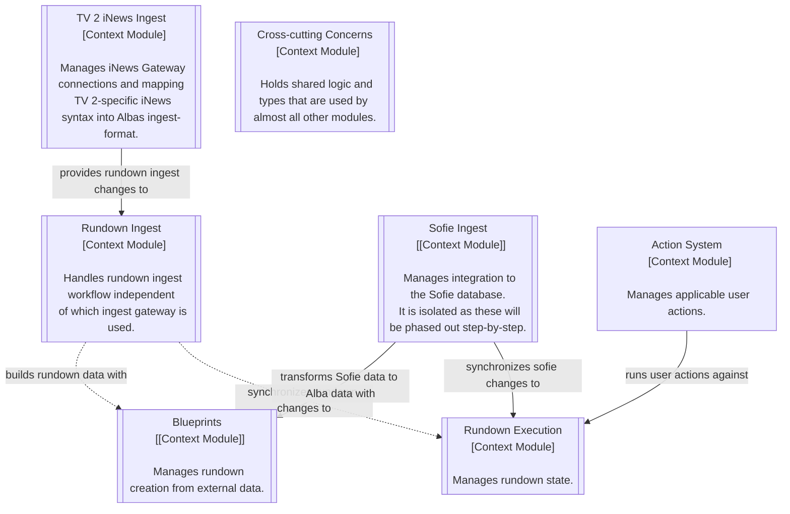
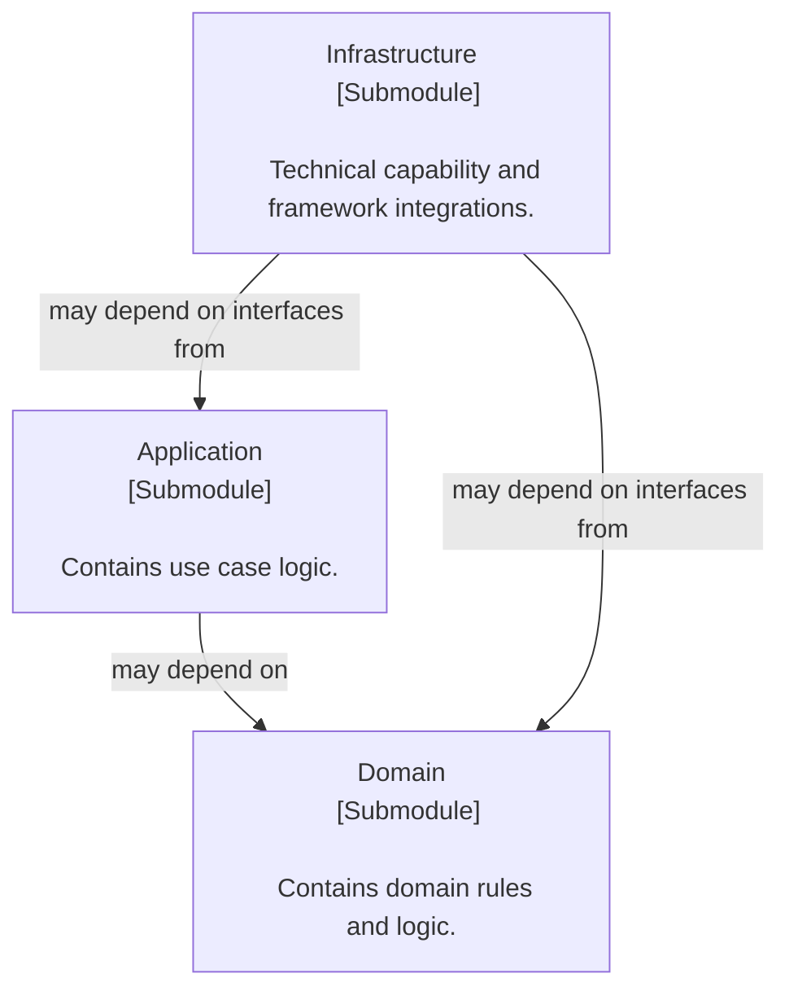

# Alba server developer guide

## Architecture

The project uses a 2-dimensional module structure, where the top-level modules are context-based, and the submodules are a simplification of the modules often used in Domain-driven Design.

### Context modules

The top-level _context_ modules represent logic components and constitutes bounded contexts, e.g. Rundown Execution, Action System, iNews Ingest and Asset Management.
The context modules at the moment are:

### Submodules

The Domain-driven Design-based submodules are:

**Domain**

The domain submodule contains structures like:

- Entities
- Value objects
- Aggregates
- Domain services
- Domain events
- Repository interfaces

**Application**

The application submodule contains structures like:

- Use case services
- DTOs and DTO mappers
- Port interfaces (e.g. HttpServer, EmailSender)
- Controllers
- Input validation

**Infrastructure**

The infrastructure submodule contains structures like:

- Repository implementations.
- External service integrations (HttpServer, MailSender, HttpRequestService, Database, Logging).
- Application configuration management.

### Module interaction

_Contracts_ in the following table is used as a term for exposed structures, which can be interfaces, facades, services or the like.
Intra-module dependencies:

| From \ To          | Domain     | Application | Infrastructure |
|:-------------------|:-----------|:------------|:---------------|
| **Domain**         | Everything |             |                |
| **Application**    | Contracts  | Everything  |                |
| **Infrastructure** | Contracts  | Contracts   | Everything     |

Inter-module dependencies:

| From \ To          | External Domain | External Application | External Infrastructure |
|:-------------------|:----------------|:---------------------|:------------------------|
| **Domain**         | Interface       |                      |                         |
| **Application**    |                 | Interface            |                         |
| **Infrastructure** |                 |                      | Interface               |

All inter-module dependencies should be used with caution.

The Cross-cutting Concerns module may not depend on any other module and the allowed dependencies on the Cross-cutting Concerns module is more relaxed than what is described in the table above.